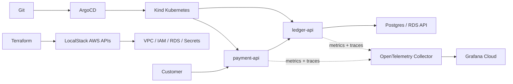

# Architecture

## Core Shape

PayRail has two application services:

- `payment-api` accepts `POST /payments`, records a pending transaction, and emits a settlement callback.
- `ledger-api` receives `POST /settlement-webhook`, verifies the request, handles idempotency, and marks the ledger entry settled.

Everything else exists to demonstrate platform judgment: infrastructure as code, GitOps, observability, policy enforcement, failure drills, and incident documentation.

## Why One Repo

For a portfolio project, separate docs and infrastructure repositories create more process than value. A single repo makes the evaluation path obvious: clone it, read the scope, run the local platform, inspect the incident evidence.

## Why LocalStack First

AWS is useful for proving cloud primitives, but it is too expensive to be the default test environment for this project. LocalStack gives the Terraform code an AWS-compatible API target for VPC, IAM, RDS, Secrets Manager, and related resources without requiring a live AWS account for routine development.

Real AWS remains an explicit opt-in path. Someone who wants to validate against AWS can swap the provider configuration and add the S3 backend example under `infra/`.

## Why Kind Still Matters

LocalStack can model AWS service APIs, but the project still needs real Kubernetes workload behavior: pods, services, policy admission, rollouts, failure injection, and GitOps sync. Kind is the right default for that loop because it is fast, free, and close enough to Kubernetes for the incidents PayRail needs to demonstrate.

## Why ArgoCD Instead Of Flux

Flux would be a comfortable choice, but ArgoCD is useful portfolio surface area here: it provides a clear UI, obvious sync history, and rollback evidence that can be captured during incident writeups.

## Why Kyverno Instead Of OPA/Gatekeeper

The first governance goals are Kubernetes-native policy checks: no privileged containers, required resource requests and limits, and no mutable `:latest` image tags. Kyverno expresses those checks directly against Kubernetes resources with lower ceremony than Rego, which keeps the project focused on demonstrating prevention and remediation rather than building a policy language showcase.

## Open Architecture Work

- Add the actual `payment-api` and `ledger-api` services.
- Add Kind bootstrap manifests for ArgoCD, Kyverno, and application namespaces.
- Add LocalStack-backed RDS, Secrets Manager, and IAM resources.
- Add OpenTelemetry Collector configuration and Grafana Cloud export settings.
- Add incident-specific runbooks, dashboards, and postmortems.
